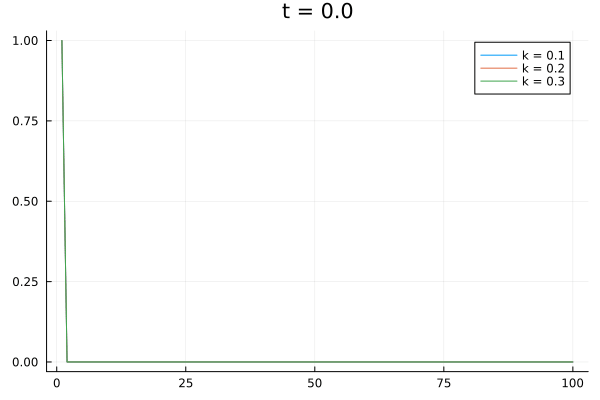

# MetCompC

Meus códigos desenvolvidos durante o curso Métodos Computacionais da Física C, ministrado pelo professor Leonardo Gregory Brunnet.

---

Integração da equação $\frac{\partial f}{\partial t} = D\frac{\partial^2 f}{\partial x^2}$ para múltiplos $D$'s com a mesma condição inicial.

# Estrutura do Projeto

- [src](src): Contém utilidades gerais (Métodos numéricos, funções para fazer gráficos, etc)
- [aulas](aulas): Contém os códigos dos exercícios feitos em aula (A implementação dos métodos numéricos sempre está em [src](src), mas o código que os utiliza para resolver exercícios sempre está aqui). Cada pasta representa uma aula, cujo nome está relaciona com o tópico da mesma.
